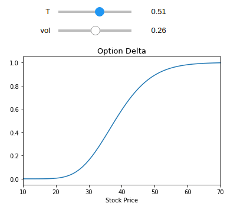
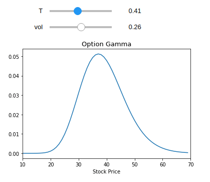
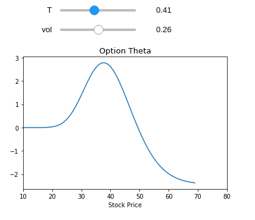

## Interactive Option Greeks

* This notebook allows you to visualize the option greeks (Delta, Gamma, Theta) as a function of a time and volatility which helps provide some intutition. 

## Option Delta as a function of time and volatility

## Option Gamma as a function of time and volatility

## Option Theta as a function of time and volatility

